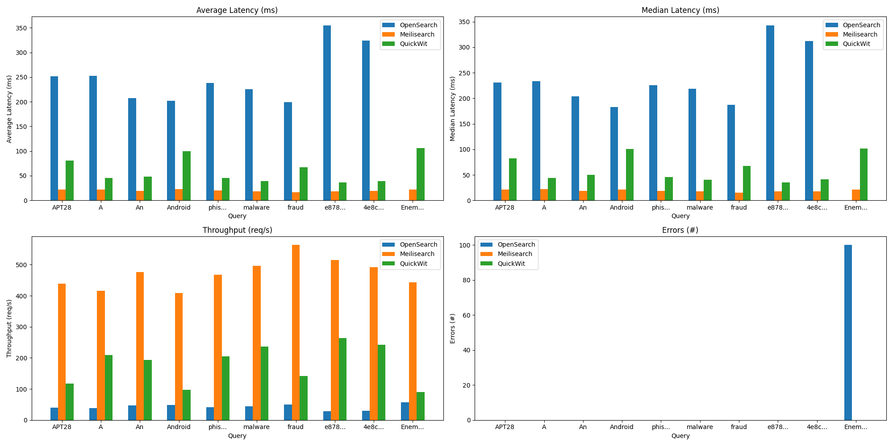

# MGTS-bench

Repository to test the performance of several full-text search engines on the [MISP-galaxy]() dataset.

# Test environment

To be able to compare the results of different search engines LXD is used to create an isolated environment for every engine.

>Note: You might need to add the following line to /etc/opensearch/opensearch.yml:
indices.query.bool.max_clause_count: 4096

Specs:
- CPU cores: 2
- Memory: 4GB

# Results

